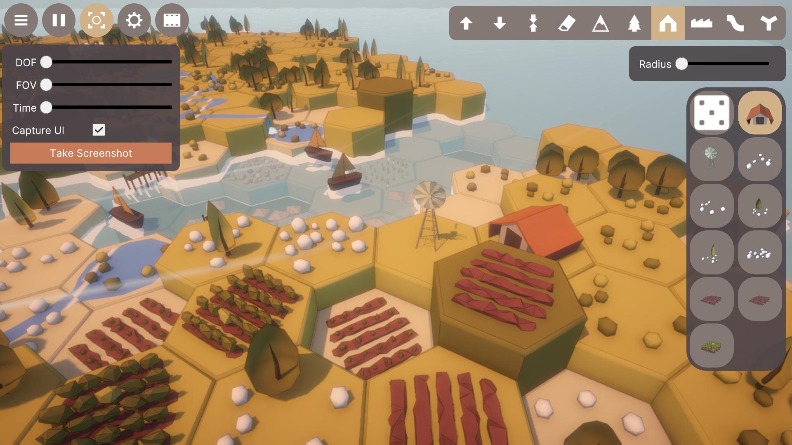
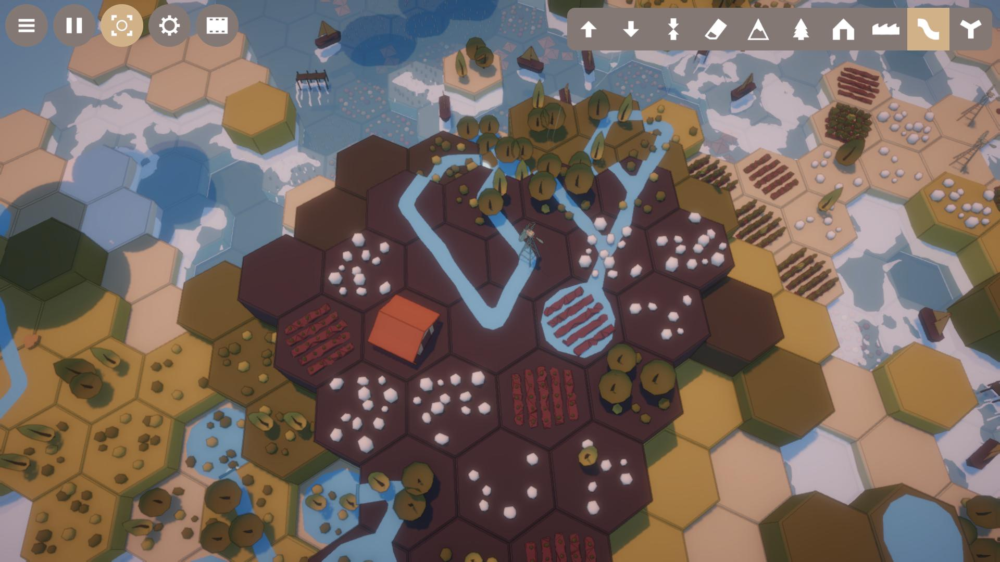
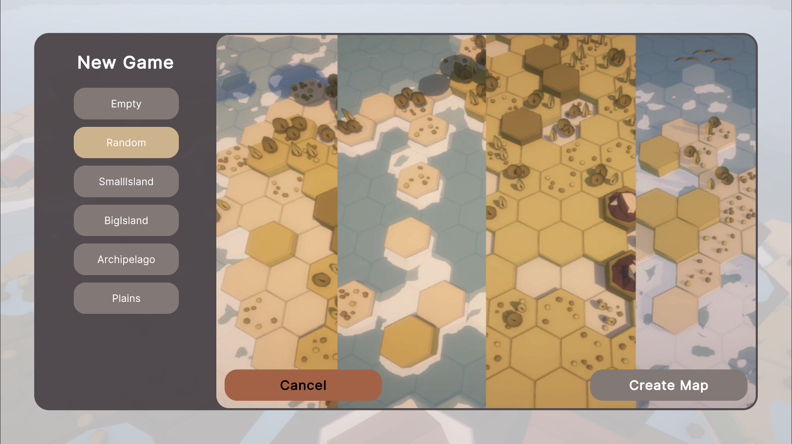
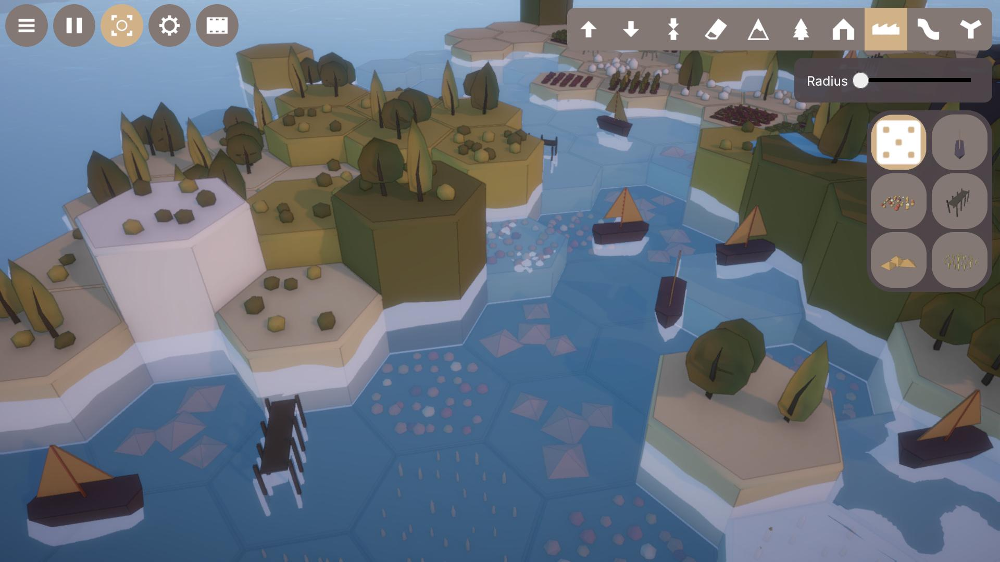
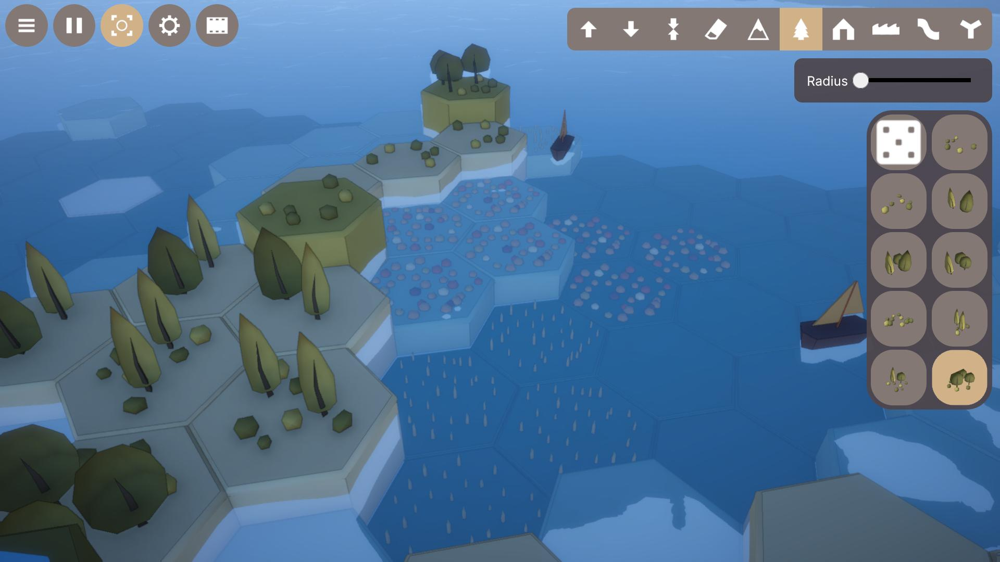
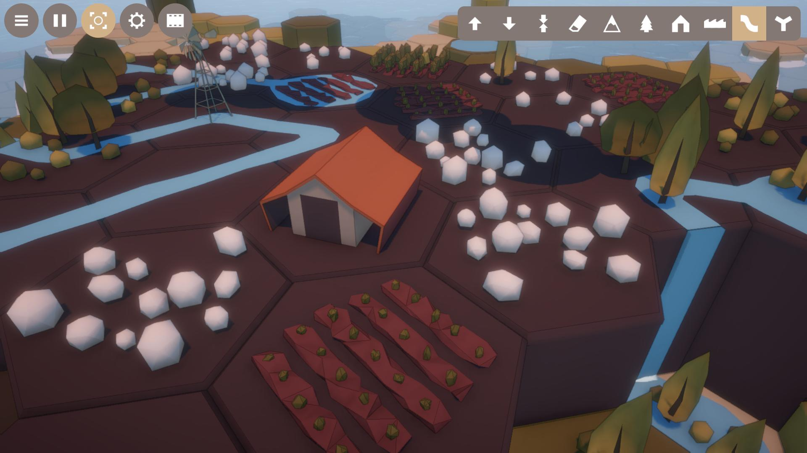

# Hex Builder

## Overview
Years ago, when I was first learning Unity, I attempted an mostly failed to make a game that was a mashup of the board games Catan, Carcassonne and Scrabble. I found that the most enjoyable part of that project, was the Level Editor. This is a toy that mostly scratches that same itch, while being a much better made program.

	
	
	
  
  
  

## Current Features
- Random terrain generation using FBM and falloffs.
- Tools for manual terrain manipulation, using an area of effect.
- Placement of features on faces, edges or vertices
- Serialization / Deserialization of game data.
- Particle effects - gpu or cpu particles, dependent on platform
- Day / Night cycle
- Screenshot tool that allows for adjusting Camera Field of View, Depth of Field and Time of Day.
- Screensaver mode, that chooses random tiles and animates camera view to create an endless animation.
- Audio
- Tweening

## Dependencies
- **Unity 6.2**
  - Other Unity 6.x versions may work but are untested
- **Target Platforms**
  - Windows
  - macOS
  - WebGL (with limitations)

No external Unity packages or plugins are required beyond the standard Unity install.

## Project Structure
This repository is a complete Unity project.

Notable areas of interest:
- `Assets/Scripts/App/App.cs` — Bootstrapper for the entire application. Start here.
- `Assets/Scenes/Game/Game.cs` — Bootstrapper for the Game. All game logic stems from here.

## How to Run

### Open in Unity
1. Clone or download this repository.
2. Open **Unity Hub**.
3. Select **Open Project** and choose the repository root.
4. Open the main scene and press **Play**.

### Play a Build
A WebGL version is available on Itch.io:
**Itch.io page:** https://msgraham.itch.io/hexbuilder

### Controls
- Left Click = use selected tool
- Left Click + drag = pan camera
- Mouse Wheel = zoom
- Right click + drag = rotate camera (or hold down alt on windows / option on mac)

## References
- Screen Based outline shader based on this tutorial by Digvijaysinh Gohil: https://www.youtube.com/watch?v=nc3a3THBFrg
- Service Locator based on a tutorial from Git-Ammend: https://www.youtube.com/watch?v=D4r5EyYQvwY
- Event Bus based on a tutorial from Git-Ammend: https://www.youtube.com/watch?v=4_DTAnigmaQ
- Tweening based on a tutorial by Sasquatch B Studios: https://www.youtube.com/watch?v=43o0FzU55V4